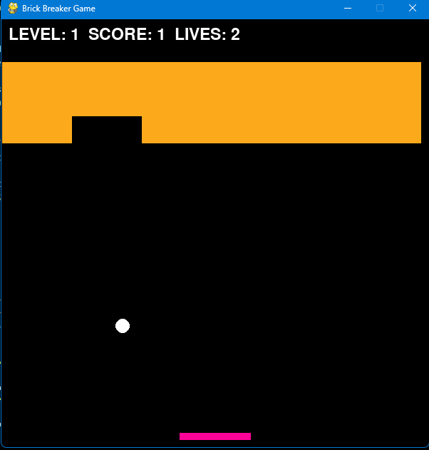

# Brick Breaker Game - Version 1.5

## Changelog

### Version 1.5
- Added screen size customization at the start of the game.
- Improved paddle movement for smoother gameplay.
- Added restart button on the game over screen.
- Adjusted ball and paddle positions for better visibility.
- Enhanced game over screen with options to restart or exit.

### Version 1.4
- Implemented a pause feature (press SPACE to pause/unpause during gameplay).
- Improved collision detection for a more accurate gaming experience.
- Added sound effects for ball hits and game over.

### Version 1.3
- Introduced power-ups that appear randomly when a brick is destroyed.
- Added a scoring system to track player performance.
- Implemented multiple levels with increasing difficulty.
- Updated the game over screen with the final score.

### Version 1.2
- Enhanced the paddle movement for better control.
- Added a menu screen with instructions and a prompt to start the game.

### Version 1.1
- Refactored code for better readability and maintainability.
- Addressed issues related to paddle movement and ball behavior.
- Included game constants for easier customization.

### Version 1.0
- Initial release with basic gameplay features.
- Simple paddle and ball mechanics.
- Bricks arranged in three rows.
- Game over screen displaying the final score.

## Screenshots

*Gameplay Screenshot*

*Game Over Screen*

## License

This project is licensed under the [GNU General Public License (GPL)](LICENSE.txt). See the [LICENSE.txt](LICENSE.txt) file for details.

